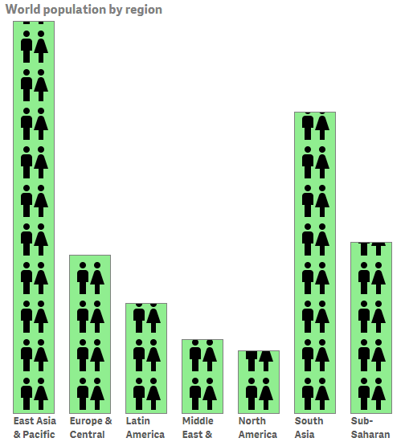
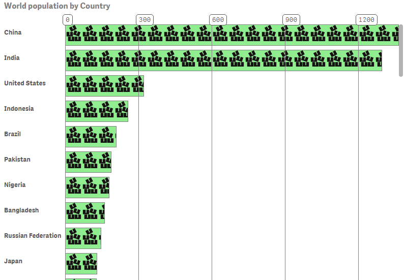

# Qlik Sense Image Chart extension
Image chart extension for Qlik Sense. Allows you to use your own image in chart bars.

This extension allows you to use images in your bars. You can use images from the Qlik Sense app, from Qlik Sense content library or from external sources.

Both horizontal and vertical orientation is available. You can also add gridlines, modify bar width and spacing and add your own styling to bars and labels.

###Version 1.1
You can now have different images for the bars. You do this by entering an expression that returns the image as the second measure and select '2nd measure' as the image property.

###Properties available

Section       | Property    | Default      | Description
---           | ---         | ---          | ---
Orientation and image | Orientation | Horizontal | Bar orientation. Horizontal allows scrolling, vertical not.
  | Image   | No image | Image to use. 'No image', 'Link' : link to image in separate field, '2nd measure': link to image as second measure. List includes all images available in app or content library.
  | Link | | If Image is Link. Link to external image.
  | Background color| lightgreen | CSS color to use for background.
  | Horiz repeat | repeat | Should the image be repeated horizontally?
  | Vert repeat | repeat | Should the image be repeated vertyically?
Width and styling | Bar Width | 60 | Bar width in pixels
    | Spacing | 10 | Space between bars in pixels
    | Bar style |border: 1px solid grey;| Additional CSS styling for bars. Use background-size if you want to scale your image.
    | Label style |font-weight:bold; | Additional styling for labels.
Scale and gridlines | Min | 0 | Scale minimum
    | Max | 0 | Scale maximum. If zero, use measure max value.
    | Show gridlines| true |
    | Step | 0 | Grid line step. If zero step size will be auto calculated.
